# Username enumeration via subtly different responses

**Level**: Practitioner

**Mục tiêu**: Brute-force để tìm được username và password đúng.

---

## Chuẩn bị
2 file wordlist:
- `username.txt`: danh sách username
- `password.txt`: danh sách password

Mở lab bằng Burp Browser.

Bật `Intercept: ON` trong Burp Suite.

## Bước 1: Bắt request đăng nhập

- Truy cập trang login của lab.
- Thử login với username và password bất kỳ.

Burp sẽ chặn request → Forward để xem response.

Quan sát response trả về:

```
Invalid username or password
```

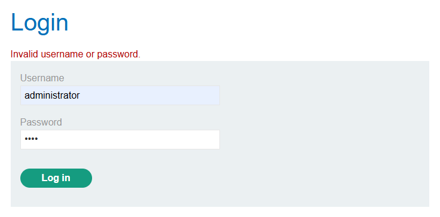

## Bước 2: Gửi request vào Intruder

- Chuột phải vào request login trong Burp.

- Chọn `Send to Intruder`.

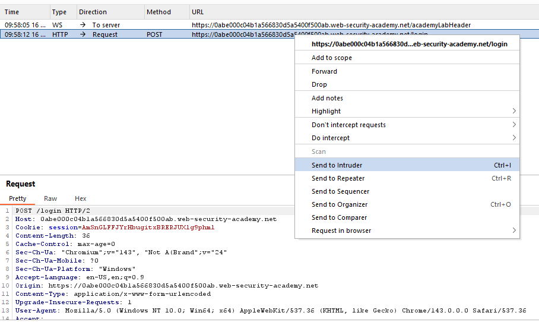

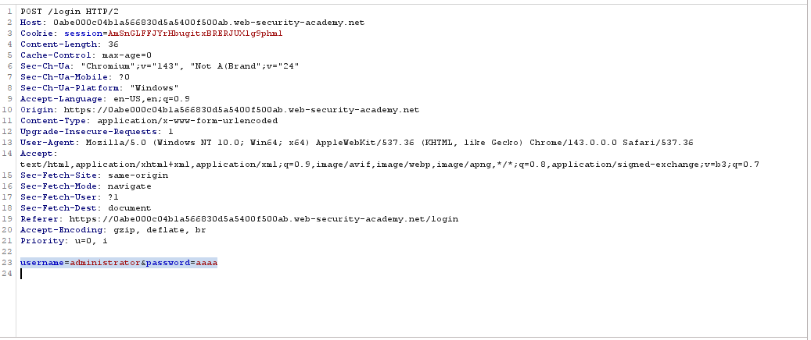

## Bước 3: Brute-force username

Sau đây ta sẽ brute force username theo file `username.txt` trước.

- Chọn vị trí chèn payload: 
  - Tìm tham số `username=`
  - Bôi đen giá trị username
  - Nhấn `Add §`

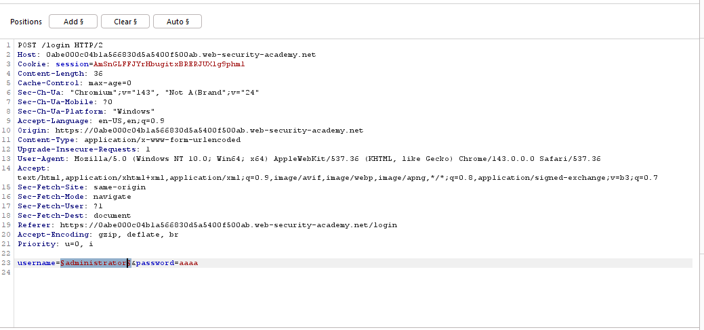

- Load các username: Sang tab `Payloads`, đảm bảo các thông tin sau:
    - Payload type: `Simple list`
    - Payload Configuration: Nhấn `Load` -> Chọn file `username.txt` -> OK

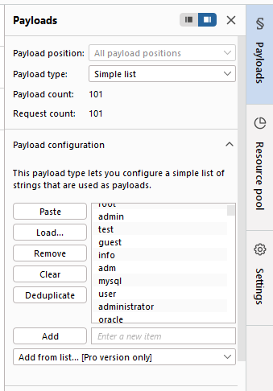

- Sang tab `Settings`
    - Tìm mục `Grep & Extract`
    - Nhấn `Add`
    - Chọn `Fetch response`
    - Bôi đen chuỗi: `Invalid username or password`
    - Nhấn OK

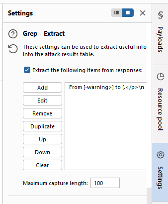

- Ấn `Start Attack`.

Phân tích:

- Hầu hết các response khác đều giống nhau.
- Chỉ có response này khác (không có dấu `.`)

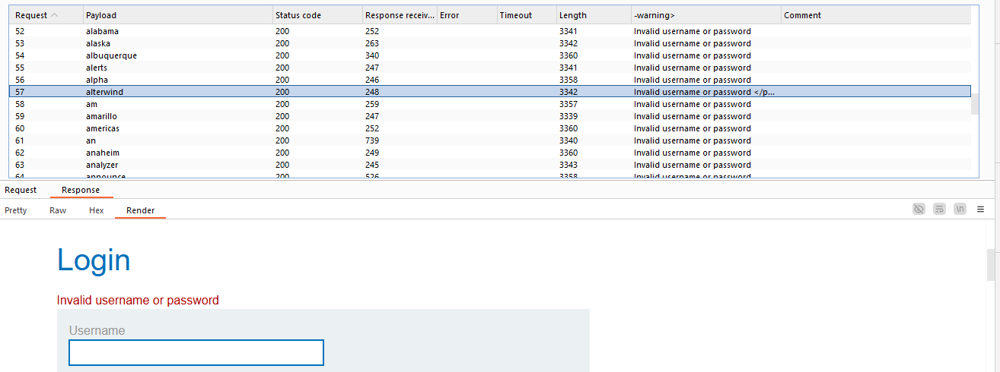

- Ta có thể suy ra response không có dấu `.` là username đúng: `alterwind`

## Bước 4: Brute-force password

Quay lại Intruder, làm tương tự với password để brute-force:

- Chọn vị trí payloads: 
  - Quay lại tab `Positions`
  - Xóa dấu § ở username (nếu còn)
  - Bôi đen giá trị sau `password=`
  - Nhấn `Add §`

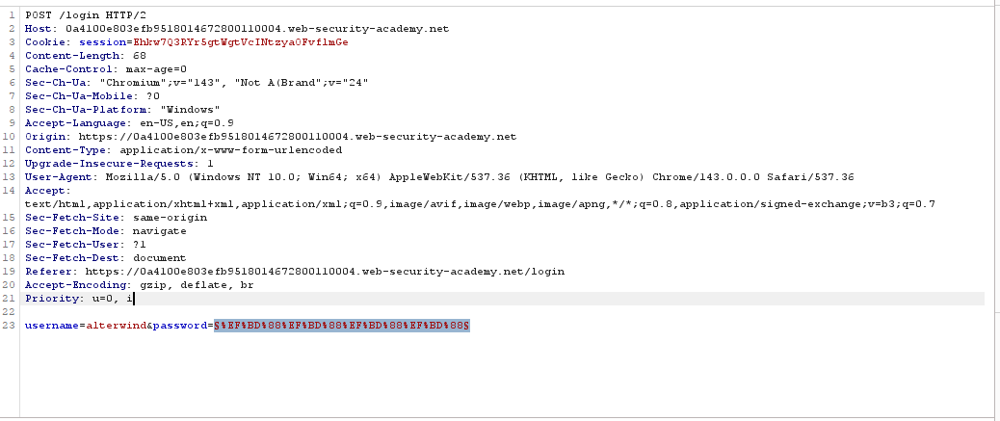

- Load danh sách password:
  - Sang tab `Payloads`
  - Nhấn `Clear` để xóa payload cũ
  - Nhấn `Load` → chọn file `password.txt`

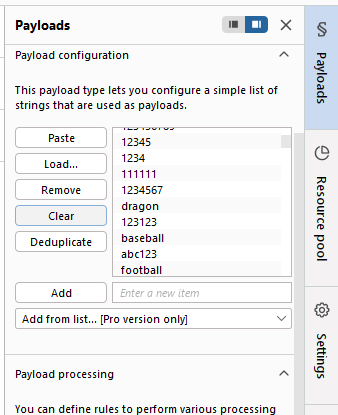

- Cấu hình lại `Grep & Extract`:
  - Nhấn `Clear` để xóa cấu hình cũ
  - Nhấn `Add` → `Fetch response`
  - Bôi đen `Invalid username or password`
  - Nhấn OK

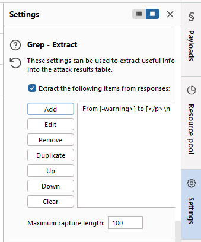

- Ấn `Start Attack`.

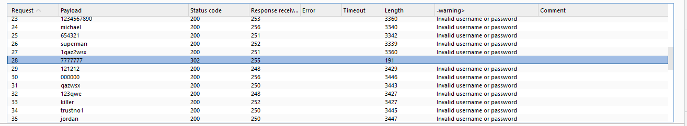

Quan sát các response, ta thấy được password là `7777777`.

Thử lại với username và password vừa tìm được là xong lab!