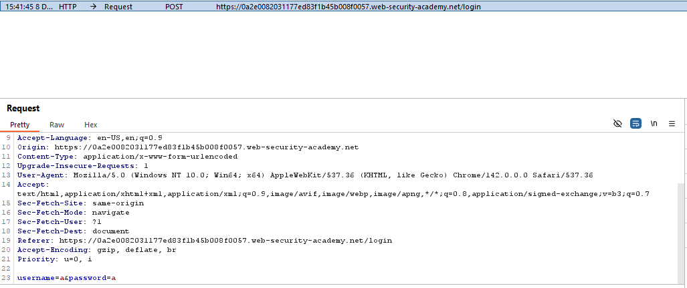

# Username enumeration via subtly different responses

**Level**: Practitioner

**Mục tiêu**:

---

Lưu list các username và password lab cho vào 2 file `username.txt` và `password.txt`.

Mở lab trong Burp Browser (Intercept: ON).

Thử đăng nhập bằng username và password bất kì để bắt request.

Gửi request này vào Intruder (Right-click -> Send to Intruder).

------------------ CHƯA XONG